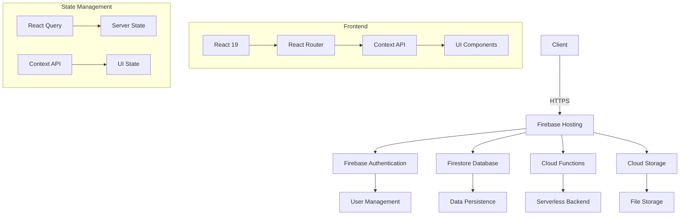

# 🍽️ StreetFeast - Food Delivery Platform

[](https://opensource.org/licenses/MIT)
[](https://reactjs.org/)
[](https://www.typescriptlang.org/)
[](https://vitejs.dev/)
[](https://firebase.google.com/)

## 🚀 Project Overview

StreetFeast is a modern, full-stack food delivery platform connecting customers with local food vendors and suppliers. Built with React 19, TypeScript, and Firebase, it offers a seamless experience for customers, vendors, and suppliers with role-based access control, real-time updates, and a beautiful, responsive UI.

## ✨ Key Features

### 🛒 Customer Experience
- Browse restaurants and menus with beautiful food imagery
- Real-time order tracking
- Secure payment processing
- Order history and reordering
- Customer reviews and ratings
- Personalized recommendations

### 🏪 Vendor Dashboard
- Menu management
- Order management system
- Sales analytics and reporting
- Business performance metrics
- Inventory management
- Promotions and discounts

### 🚚 Supplier Portal
- Order fulfillment tracking
- Inventory management
- Delivery scheduling
- Supplier analytics
- Invoice generation

## 🛠️ Technology Stack

### Frontend
- **Framework**: React 19 with Vite
- **Language**: TypeScript 5.x
- **State Management**: React Query + Context API
- **UI Components**: Custom component library with Radix UI primitives
- **Styling**: Tailwind CSS with custom theming
- **Form Handling**: React Hook Form with Zod validation
- **Routing**: React Router v7
- **Charts**: Recharts & Chart.js
- **Maps**: React Leaflet
- **Icons**: Lucide Icons

### Backend
- **Authentication**: Firebase Authentication
- **Database**: Firebase Firestore (NoSQL)
- **Storage**: Firebase Storage
- **Hosting**: Firebase Hosting
- **Cloud Functions**: Firebase Cloud Functions
- **Real-time Updates**: Firebase Realtime Database

### Development Tools
- **Package Manager**: npm
- **Linting**: ESLint with TypeScript support
- **Formatting**: Prettier
- **Git Hooks**: Husky + lint-staged
- **Testing**: Jest + React Testing Library
- **CI/CD**: GitHub Actions

## 📁 Project Structure

```
src/
├── assets/            # Static assets (images, fonts, etc.)
├── components/        # Reusable UI components
│   ├── auth/         # Authentication related components
│   ├── common/       # Shared components
│   ├── customer/     # Customer specific components
│   ├── layout/       # Layout components
│   ├── supplier/     # Supplier specific components
│   ├── theme/        # Theme related components
│   ├── ui/           # Base UI components
│   └── vendor/       # Vendor specific components
├── contexts/         # React contexts
├── firebase/         # Firebase configuration and services
├── hooks/            # Custom React hooks
├── lib/              # Utility functions and helpers
├── pages/            # Page components
│   ├── customer/     # Customer facing pages
│   ├── supplier/     # Supplier portal pages
│   └── vendor/       # Vendor dashboard pages
├── routes/           # Application routes
├── styles/           # Global styles and themes
├── types/            # TypeScript type definitions
└── utils/            # Utility functions
```

## 🏗️ Technical Architecture

### System Architecture Overview

StreetFeast follows a modern JAMstack architecture with a React frontend and Firebase backend services. The application is designed to be scalable, maintainable, and performant with a clear separation of concerns.



### Data Flow

1. **Authentication Flow**:
   - User credentials are verified through Firebase Authentication
   - JWT tokens are issued and stored securely
   - Role-based access control (RBAC) is enforced at both client and server levels

2. **Data Management**:
   - Real-time data synchronization using Firestore listeners
   - Optimistic UI updates for better user experience
   - Client-side caching with React Query for improved performance

3. **State Management**:
   - **Server State**: Managed by React Query (data fetching, caching, synchronization)
   - **UI State**: Managed by React Context (theme, modals, forms)
   - **Local State**: Component-level state using React hooks

4. **Security Model**:
   - Firebase Security Rules for database access control
   - Input validation using Zod schemas
   - Protection against common web vulnerabilities (XSS, CSRF, etc.)

### Performance Optimization

- Code splitting with React.lazy() and Suspense
- Image optimization with lazy loading
- Efficient state updates to minimize re-renders
- Service worker for offline capabilities (PWA)
- Bundle size optimization through tree-shaking and code-splitting

## 🚀 Getting Started

### Prerequisites

#### 1. System Requirements
- **Node.js 18+** (LTS version recommended)
  - Download and install from [nodejs.org](https://nodejs.org/)
  - Verify installation:
    ```bash
    node --version
    npm --version
    ```

- **npm** (Node Package Manager)
  ```bash
  # Verify npm installation
  npm --version
  ```

- **Firebase CLI** (For deployment and Firebase tools)
  ```bash
  # Install Firebase CLI globally
  npm install -g firebase-tools
  
  # Verify installation
  firebase --version
  
  # Login to Firebase
  firebase login
  ```

- **Git** (For version control)
  - Download and install from [git-scm.com](https://git-scm.com/)
  - Verify installation:
    ```bash
    git --version
    ```

#### 2. Recommended Development Tools
- **Visual Studio Code** - Code editor
- **VS Code Extensions**:
  - ESLint
  - Prettier - Code formatter
  - Tailwind CSS IntelliSense
  - Firebase
  - GitLens
  - ES7+ React/Redux/React-Native snippets

#### 3. Browser Requirements
- Latest version of Chrome, Firefox, Safari, or Edge
- Enable JavaScript in your browser

### Installation Guide

#### 1. Clone the Repository

```bash
# Clone the repository
gh repo clone farhaanthebillionaire/streetfeast

# Or using HTTPS
# git clone https://github.com/farhaanthebillionaire/streetfeast.git

# Navigate to project directory
cd streetfeast
```

#### 2. Install Dependencies

```bash
# Install all dependencies
npm install
```

#### 3. Configure Environment Variables

1. Create a `.env` file in the root directory:
   ```bash
   cp .env.example .env
   ```

2. Open `.env` and update with your Firebase project credentials:
   ```env
   # Firebase Configuration
   VITE_FIREBASE_API_KEY=your_api_key
   VITE_FIREBASE_AUTH_DOMAIN=your_project_id.firebaseapp.com
   VITE_FIREBASE_PROJECT_ID=your_project_id
   VITE_FIREBASE_STORAGE_BUCKET=your_project_id.appspot.com
   VITE_FIREBASE_MESSAGING_SENDER_ID=your_messaging_sender_id
   VITE_FIREBASE_APP_ID=your_app_id
   VITE_FIREBASE_MEASUREMENT_ID=your_measurement_id
   
   # Optional: Enable debug mode
   VITE_DEBUG=true
   ```

#### 4. Firebase Setup

1. Create a new Firebase project at [Firebase Console](https://console.firebase.google.com/)
2. Enable Authentication (Email/Password, Google, etc.)
3. Create a Firestore database in production mode
4. Set up Storage with appropriate security rules
5. Get your Firebase config from Project Settings > General > Your apps > SDK setup and configuration > Config

#### 5. Start Development Server

```bash
# Start the development server
npm run dev

# The application will be available at:
# http://localhost:5173

# For production build
npm run build
npm run preview
```

#### 6. Running Tests

```bash
# Run all tests
npm test

# Run tests in watch mode
npm test -- --watch

# Generate test coverage report
npm test -- --coverage
```

### Common Setup Issues

1. **Firebase Connection Issues**
   - Verify your Firebase configuration in `.env`
   - Check if your IP is whitelisted in Firebase Console
   - Ensure the Firebase project has the required services enabled

2. **Dependency Installation**
   - Clear npm cache: `npm cache clean --force`
   - Delete `node_modules` and `package-lock.json`
   - Run `npm install` again

3. **Environment Variables**
   - Ensure all required variables are set in `.env`
   - Restart the development server after making changes to `.env`
   - Check for typos in variable names

4. **Port Conflicts**
   - If port 5173 is in use, you can specify a different port:
     ```bash
     npm run dev -- --port 3000
     ```

## 🚀 Deployment Guide

### 1. Production Build

Create an optimized production build:

```bash
# Create production build
npm run build

# The build output will be in the 'dist' directory
```

### 2. Firebase Deployment

#### Prerequisites
- Firebase CLI installed and logged in
- Firebase project created and configured
- Billing enabled (for Blaze plan if using Cloud Functions)

#### Deployment Steps

1. **Initialize Firebase** (first time only):
   ```bash
   firebase init
   ```
   - Select Hosting and any other Firebase services you're using
   - Choose your Firebase project
   - Set `dist` as your public directory
   - Configure as a single-page app: Yes
   - Set up automatic builds and deploys with GitHub: No

2. **Deploy to Firebase Hosting**:
   ```bash
   # Build the project
   npm run build
   
   # Deploy to Firebase
   firebase deploy --only hosting
   ```

3. **Deploy Firebase Rules & Functions** (if applicable):
   ```bash
   # Deploy Firestore rules
   firebase deploy --only firestore:rules
   
   # Deploy Storage rules
   firebase deploy --only storage:rules
   
   # Deploy Cloud Functions
   firebase deploy --only functions
   
   # Deploy everything
   firebase deploy
   ```

### 3. Environment-Specific Builds

For different environments (development, staging, production), you can create separate `.env` files:

- `.env.development` - Local development
- `.env.staging` - Staging environment
- `.env.production` - Production environment

Update your `package.json` scripts:

```json
"scripts": {
  "dev": "vite",
  "build": "tsc && vite build",
  "build:staging": "tsc && vite build --mode staging",
  "preview": "vite preview"
}
```

### 4. CI/CD Pipeline

Example GitHub Actions workflow (`.github/workflows/deploy.yml`):

```yaml
name: Deploy to Firebase Hosting
on:
  push:
    branches: [ main ]
  pull_request:
    branches: [ main ]

jobs:
  build-and-deploy:
    runs-on: ubuntu-latest
    steps:
      - uses: actions/checkout@v3
      
      - name: Use Node.js 18
        uses: actions/setup-node@v3
        with:
          node-version: '18'
          cache: 'npm'
      
      - name: Install Dependencies
        run: npm ci
      
      - name: Build
        run: npm run build
        env:
          VITE_FIREBASE_API_KEY: ${{ secrets.FIREBASE_API_KEY }}
          VITE_FIREBASE_AUTH_DOMAIN: ${{ secrets.FIREBASE_AUTH_DOMAIN }}
          # Add other environment variables here
      
      - name: Deploy to Firebase
        uses: FirebaseExtended/action-hosting-deploy@v0
        with:
          repoToken: '${{ secrets.GITHUB_TOKEN }}'
          firebaseServiceAccount: '${{ secrets.FIREBASE_SERVICE_ACCOUNT }}'
          channelId: live
          projectId: your-project-id
```

### 5. Post-Deployment

1. **Verify Deployment**:
   - Check the Firebase Console for any deployment errors
   - Test all major user flows
   - Verify environment variables in production

2. **Monitoring**:
   - Set up Firebase Performance Monitoring
   - Configure Error Reporting
   - Set up alerts for critical issues

3. **Scaling**:
   - Configure Firestore indexes
   - Set up Firebase Hosting CDN caching
   - Monitor database performance

### 6. Rollback Plan

If something goes wrong:

```bash
# List recent deploys
firebase hosting:channel:list

# Rollback to a specific version
firebase hosting:rollback VERSION_ID
```

## 🔧 Development Workflow

### 1. Branch Strategy
- `main` - Production-ready code
- `develop` - Integration branch for features
- `feature/*` - New features
- `bugfix/*` - Bug fixes
- `hotfix/*` - Critical production fixes

### 2. Commit Message Convention

We follow [Conventional Commits](https://www.conventionalcommits.org/):

```
<type>[optional scope]: <description>

[optional body]

[optional footer(s)]
```

Example:
```
feat(auth): add Google OAuth login

- Add Google OAuth button component
- Implement Firebase Google auth provider
- Update user context with auth state

Closes #123
```

### 3. Code Review Process
1. Create a Pull Request from your feature branch to `develop`
2. Request reviews from at least one team member
3. Address all review comments
4. Ensure all tests pass
5. Get approval before merging

### 4. Documentation Updates
- Update relevant documentation when making changes
- Add JSDoc comments for new components and functions
- Keep the README up to date with new features

## ✅ Completed Features

### Authentication & User Management
- [x] Email/Password authentication
- [x] Social login (Google, Facebook)
- [x] Role-based access control (Customer, Vendor, Supplier, Admin)
- [x] User profile management
- [x] Password reset flow

### Customer Features
- [x] Restaurant browsing and search
- [x] Menu viewing with categories
- [x] Shopping cart functionality
- [x] Checkout process
- [x] Order tracking
- [x] Order history
- [x] Favorites and saved addresses

### Vendor Features
- [x] Dashboard with key metrics
- [x] Menu management (CRUD operations)
- [x] Order management
- [x] Sales reports
- [x] Business analytics

### Supplier Features
- [x] Order fulfillment tracking
- [x] Inventory management
- [x] Delivery scheduling
- [x] Supplier analytics

### UI/UX
- [x] Responsive design for all devices
- [x] Dark/light theme support
- [x] Custom component library
- [x] Loading states and error handling
- [x] Form validation
- [x] Toast notifications

## 🚧 Pending Features

### Core Features
- [ ] Real-time chat support
- [ ] Multi-language support
- [ ] Advanced search filters
- [ ] Loyalty program
- [ ] Gift cards

### Customer Experience
- [ ] Voice search
- [ ] Augmented Reality menu preview
- [ ] Scheduled orders
- [ ] Group ordering

### Vendor Features
- [ ] Staff management
- [ ] Table reservation system
- [ ] Advanced analytics
- [ ] Marketing tools

### Supplier Features
- [ ] Automated inventory management
- [ ] Supplier ratings and reviews
- [ ] B2B ordering system

### Technical Debt
- [ ] Comprehensive test coverage
- [ ] Performance optimization
- [ ] Bundle size reduction
- [ ] Documentation improvements

## 📚 Documentation

- [API Documentation](docs/API.md)
- [Component Library](docs/COMPONENTS.md)
- [Deployment Guide](docs/DEPLOYMENT.md)
- [Testing Guide](docs/TESTING.md)

## 🤝 Contributing

Contributions are welcome! Please read our [Contributing Guidelines](CONTRIBUTING.md) for details on our code of conduct and the process for submitting pull requests.

## 📄 License

This project is licensed under the MIT License - see the [LICENSE](LICENSE) file for details.

## 🙏 Acknowledgments

- [React](https://reactjs.org/)
- [Firebase](https://firebase.google.com/)
- [Tailwind CSS](https://tailwindcss.com/)
- [Radix UI](https://www.radix-ui.com/)
- [Lucide Icons](https://lucide.dev/)
- And all other amazing open-source projects that made this possible!

- [@vitejs/plugin-react](https://github.com/vitejs/vite-plugin-react/blob/main/packages/plugin-react) uses [Babel](https://babeljs.io/) for Fast Refresh
- [@vitejs/plugin-react-swc](https://github.com/vitejs/vite-plugin-react/blob/main/packages/plugin-react-swc) uses [SWC](https://swc.rs/) for Fast Refresh

## Expanding the ESLint configuration

If you are developing a production application, we recommend updating the configuration to enable type-aware lint rules:

```js
export default tseslint.config([
  globalIgnores(['dist']),
  {
    files: ['**/*.{ts,tsx}'],
    extends: [
      // Other configs...

      // Remove tseslint.configs.recommended and replace with this
      ...tseslint.configs.recommendedTypeChecked,
      // Alternatively, use this for stricter rules
      ...tseslint.configs.strictTypeChecked,
      // Optionally, add this for stylistic rules
      ...tseslint.configs.stylisticTypeChecked,

      // Other configs...
    ],
    languageOptions: {
      parserOptions: {
        project: ['./tsconfig.node.json', './tsconfig.app.json'],
        tsconfigRootDir: import.meta.dirname,
      },
      // other options...
    },
  },
])
```

You can also install [eslint-plugin-react-x](https://github.com/Rel1cx/eslint-react/tree/main/packages/plugins/eslint-plugin-react-x) and [eslint-plugin-react-dom](https://github.com/Rel1cx/eslint-react/tree/main/packages/plugins/eslint-plugin-react-dom) for React-specific lint rules:

```js
// eslint.config.js
import reactX from 'eslint-plugin-react-x'
import reactDom from 'eslint-plugin-react-dom'

export default tseslint.config([
  globalIgnores(['dist']),
  {
    files: ['**/*.{ts,tsx}'],
    extends: [
      // Other configs...
      // Enable lint rules for React
      reactX.configs['recommended-typescript'],
      // Enable lint rules for React DOM
      reactDom.configs.recommended,
    ],
    languageOptions: {
      parserOptions: {
        project: ['./tsconfig.node.json', './tsconfig.app.json'],
        tsconfigRootDir: import.meta.dirname,
      },
      // other options...
    },
  },
])
```
